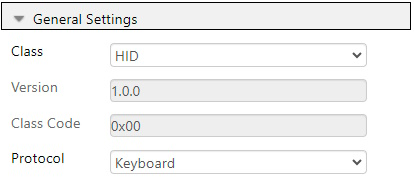
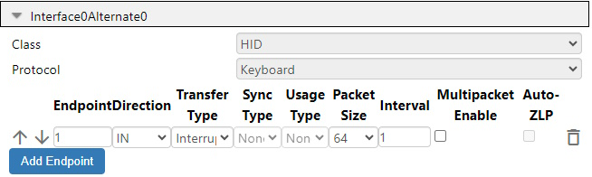
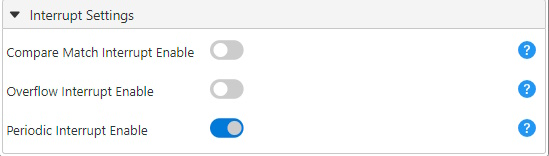

<!-- Please do not change this logo with link -->

<a target="_blank" href="https://www.microchip.com/" id="top-of-page">
   <picture>
      <source media="(prefers-color-scheme: light)" srcset="images/mchp_logo_light.png" width="350">
      <source media="(prefers-color-scheme: dark)" srcset="images/mchp_logo_dark.png" width="350">
      
   </picture>
</a>

# Matrix Keypad Demo Using The USB HID Class
This example demonstrates how the USB Human Interface Device (HID) class on the AVR® DU microcontroller (MCU), paired with the AVR64DU32 Curiosity Nano Board, is used to interface with a matrix keypad. The example may easily be changed to interface a smaller or larger matrix keypad or a keyboard.

## Related Documentation
- [AVR® DU Family Product Page](https://www.microchip.com/en-us/products/microcontrollers-and-microprocessors/8-bit-mcus/avr-mcus/avr-du?utm_source=GitHub&utm_medium=TextLink&utm_campaign=MCU8_AVR-DU&utm_content=avr64du32-cnano-usb-hid-matrix-keypad-mplab-mcc-github&utm_bu=MCU08)
- [AN3407 - Using Matrix Keypad with AVR® Devices](https://microchip.com/DS00003407)

### USB Specifications

- [USB 2.0 Specification](https://www.usb.org/document-library/usb-20-specification)
- [USB Human Interface Device (HID) Specification](https://www.usb.org/document-library/device-class-definition-hid-111)
- [Device Class Definition for HID 1.11](https://usb.org/document-library/hid-usage-tables-15)

## Software Used

- [MPLAB® X IDE 6.20.0](https://www.microchip.com/en-us/tools-resources/develop/mplab-x-ide?utm_source=GitHub&utm_medium=TextLink&utm_campaign=MCU8_AVR-DU&utm_content=avr64du32-cnano-usb-hid-matrix-keypad-mplab-mcc-github&utm_bu=MCU08) or newer
- [MPLAB® XC8 2.46](https://www.microchip.com/en-us/tools-resources/develop/mplab-xc-compilers?utm_source=GitHub&utm_medium=TextLink&utm_campaign=MCU8_AVR-DU&utm_content=avr64du32-cnano-usb-hid-matrix-keypad-mplab-mcc-github&utm_bu=MCU08) or newer
- [MPLAB® Code Configurator (MCC) plug-in 5.5.0](https://www.microchip.com/en-us/tools-resources/configure/mplab-code-configurator?utm_source=GitHub&utm_medium=TextLink&utm_campaign=MCU8_AVR-DU&utm_content=avr64du32-cnano-usb-hid-matrix-keypad-mplab-mcc-github&utm_bu=MCU08) or newer

## Hardware Used

- [AVR64DU32 Curiosity Nano (EV59F82A)](https://www.microchip.com/en-us/development-tool/EV59F82A?utm_source=GitHub&utm_medium=TextLink&utm_campaign=MCU8_AVR-DU&utm_content=avr64du32-cnano-usb-hid-matrix-keypad-mplab-mcc-github&utm_bu=MCU08)

## How it works

After the [Physical Setup](#physical-setup) and the [MPLAB® Code Configurator Setup](#mcc-setup), the matrix keypad will have pull-up resistors on all rows and columns. This will initially set the rows and columns to a high (logic 1) state. The USB start-of-frame interrupts will iterate through the columns and set a specific column low (logic 0) to measure button presses.

When a button in the active column (the one set to low) is pressed, it creates a connection between the column and the corresponding row. This connection transfers the low state from the column to the row, triggering a Falling Edge Interrupt on the row pin. The active column and the row interrupt will provide the pressed button's coordinates. These coordinates are transformed into a hexadecimal HID value, which is sent to the PC over USB and displayed as the pressed button.

For a more detailed explanation of how matrix keypads work with AVRs, visit the *Using Matrix Keypad with AVR® Devices* page under [Related Documentation](#related-documentation)

## Setup

### Physical Setup

- Connect the keypad to the AVR64DU32 Curiosity Nano as follows:
    - Row 0: PA0
    - Row 1: PA1
    - Row 2: PA2
    - Row 3: PA3
    - Column 0: PA4
    - Column 1: PA5
    - Column 2: PA6

### MCC Setup

This section shows how to set up this example in MCC. An overview of the MCC setup is shown in the image below:

#### USB General Settings
The configuration is set so the AVR DU will identify as an HID device on the highest level. The Keyboard protocol is selected for the matrix keypad.

#### USB Device Descriptors
The Device Descriptors can be left as default.

#### USB Events and Callbacks
Enable the Start Of Frame callback. This will be called every 1 ms, and handle the USB connection.

#### USB Interfaces
For this project, an HID interface is needed. Interface0Alternate0 should be added by default, and that is all that is required.

#### USB HID Interface
The interface created in the last step does not need any modification, and is best left as default.

#### USB0 Power Settings
By default, the target voltage on the AVR64DU32 Curiosity Nano is 3.3V and VUSB is connected to 3.3V using the provided jumper. However, if 5V operation is preferred, the jumper must be removed and the internal USB voltage regulator must be enabled.

### Device Clock Setup
The ``CLKCTRL`` module is located in the ``System Firmware`` drop-down menu. This example is configured to run on 12MHz, the minimum oscillator frequency available for USB on the AVR DU.

### USB Voltage Detection Setup
To ensure that the USB peripheral only tries to attach to the bus when the Curiosity Nano is connected to the PC, the Analog Comparator will periodically check if the voltage is within the acceptable range for VBUS.

#### Voltage Reference Setup
In the VREF peripheral, the Voltage Reference is set to 2.048V.

#### Analog Comparator Setup (AC)

##### Analog Comparator Hardware Settings
The Analog Comparator must be enabled by toggling Enable under Hardware Settings.

##### Analog Comparator MUX Control Settings
To measure the correct values, the positive input must be connected to AINP4, while the negative input is set to the Digital-to-Analog Converter (DAC) Reference.

##### Analog Comparator DAC Reference Settings
The DACREF register must be set to a value that can detect the correct voltage level at minimum 0.4V. The target voltage can be set directly in the Requested Voltage (V) input under Hardware Settings. Refer to the [AVR64DU32 Curiosity Nano User Guide](https://ww1.microchip.com/downloads/aemDocuments/documents/MCU08/ProductDocuments/UserGuides/AVR64DU32-Curiosity-Nano-UserGuide-DS50003671.pdf) to find the values for the voltage divider on Pin PC3.

#### Real-Time Counter Setup

##### RTC Period Settings
In the Hardware settings, the Enable RTC can remain disabled (enabled by default). Take note of the RTC Clock Source Selection (1024 Hz = 32768 Hz /32), as it will impact the Period Selection value needed for the Periodic Interrupt Timer.

##### RTC Periodic Interrupt Control Settings
The Periodic Interrupt Timer (PIT) is enabled for this example, and the period selection is set to RTC Clock Cycles 1024, to get 1 interrupt per second. This value must be changed according to the clock source selection.

##### RTC Periodic Interrupt Interrupt Control Settings
The PIT's Interrupt Flag is also enabled to allow for an interrupt routine.

#### Interrupt Manager Setup
Enable global interrupts in the ``Interrupt Manager`` under ``System Firmware``, to recognize the USB and RTC interrupts.

### Device Pin-out Setup
Nine pins are used for this example. They can be added in the ``Pin Grid View`` and configured under ``Pins`` under ``System Firmware``.
Rememeber to rename the pins to their cutom names.
- VBUS on PC3 is automatically set as analog input, with "Digital Input Buffer disabled". 
- Rows 0 to 3, on Port A pin 0 to 3 respectivly, are set to input with "Sense Falling Edge".
    - Enable Pull-Ups to ensure that no pins are floating.
    - Enable Start High, as the rows are active low.
- Columns 0 to 2, on Port A pin 4 to 6 respectivly, are set to output with "Interrupt disabled but input buffer enabled". 
    - Enable Pull-Ups, to ensure that no pins are floating.
    - Enable Start High, as the columns are active low.
- LED0 on PF2 is set to output with "Interrupt disabled but input buffer enabled".
    - Enable Start High, as the LED is active low.

## Operation

This example can be tested by following these steps:

1. Generate the MCC code and replace the generated ``main.c`` file with the given ``main.c`` from the source code.
2. Upload the c-code by connecting the ``Debugger`` plug on the Curiosity Nano Board (cnano) to the PC.
3. Connect the PC to the ``Target`` plug on the cnano using a USB-C cable.
4. Open any program that allows for text input, and press the buttons on the matrix keypad.

## Summary

This example has demonstrated how the USB HID class can be used on an AVR DU to interface a matrix keypad using the Curiosity Nano kit.
